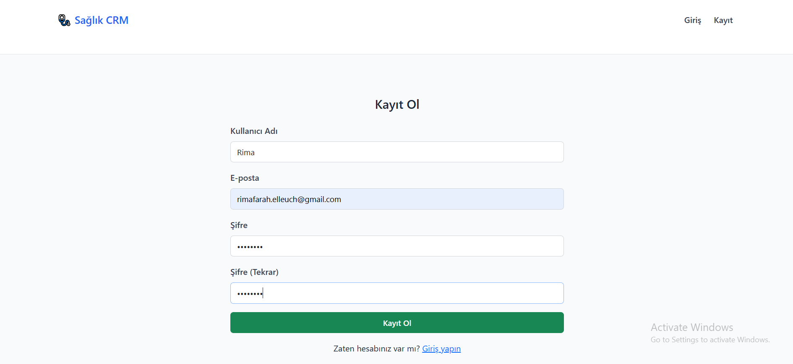
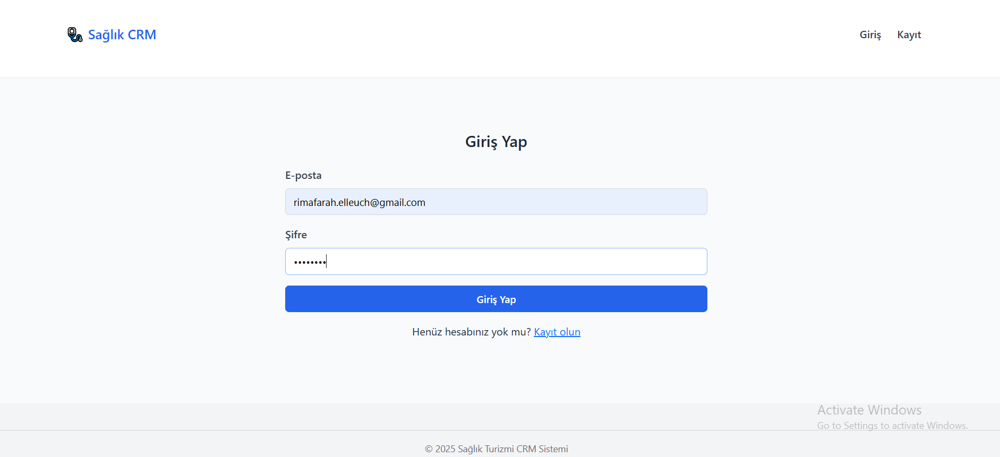
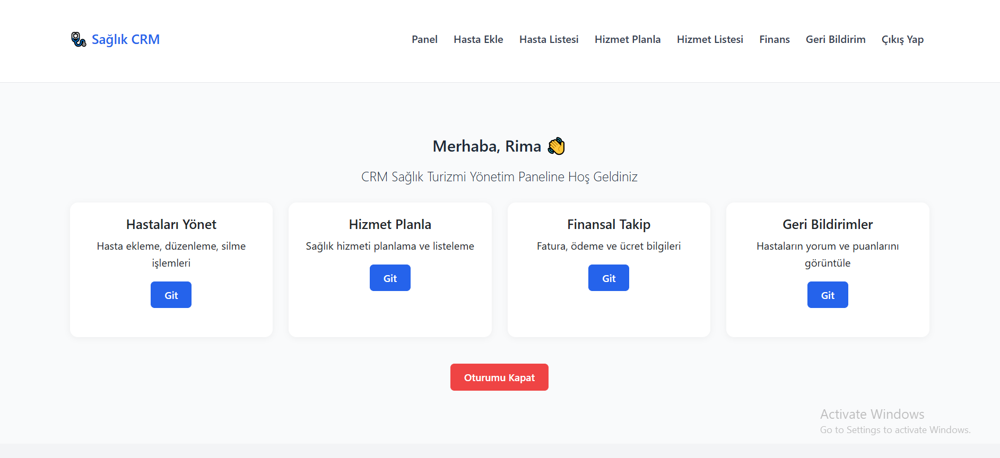
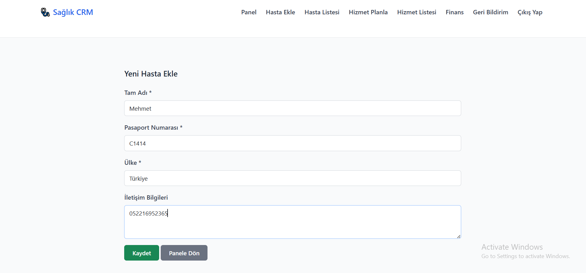
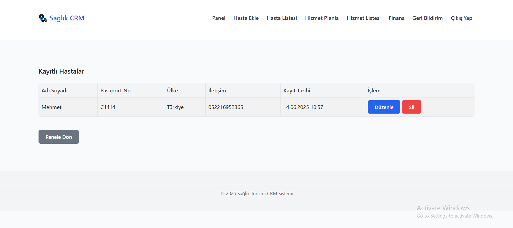
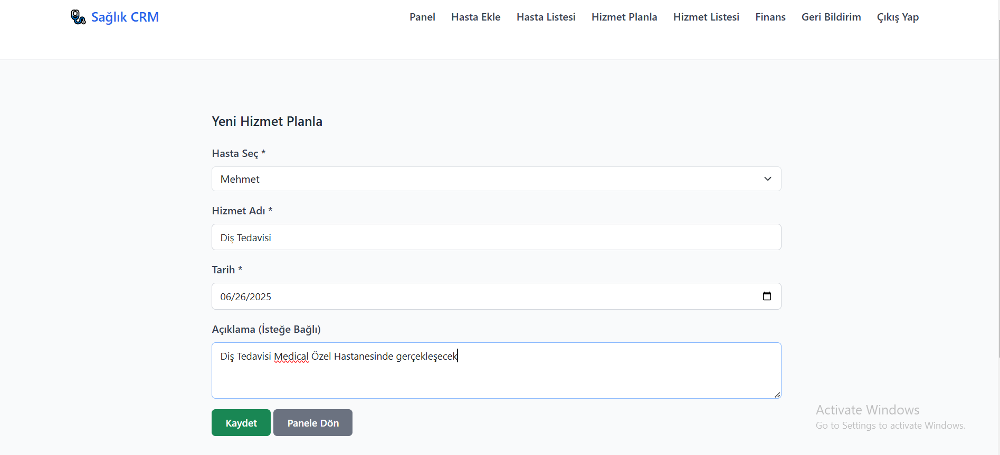
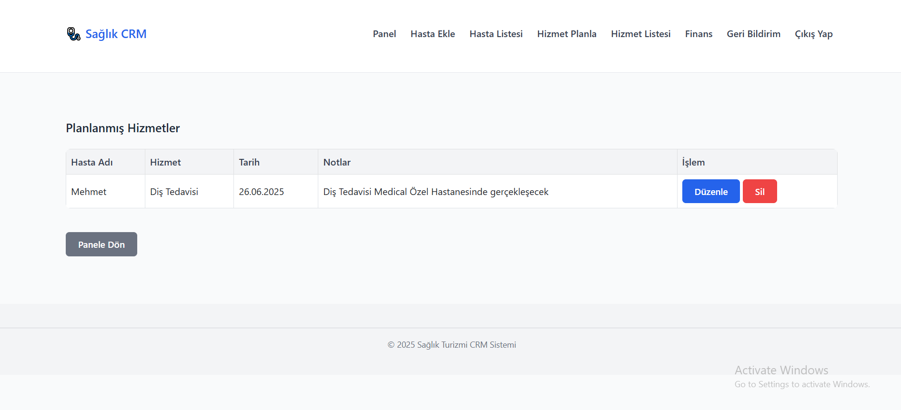
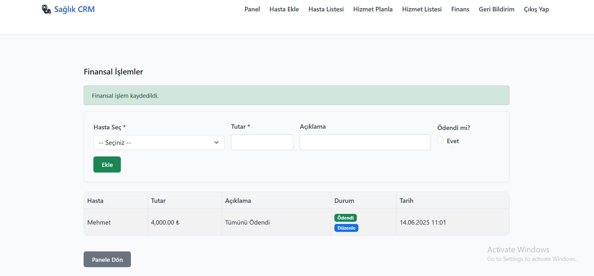
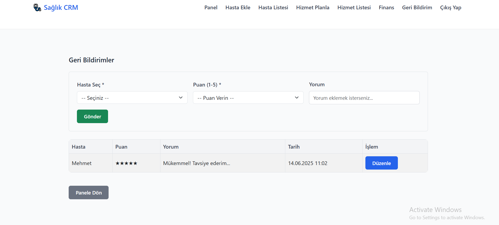

# 🩺 CRM Sağlık Turizmi Yönetim Sistemi

Bu uygulama, yurt dışından gelen hastaların sağlık hizmetlerinden sistematik ve etkin bir şekilde yararlanabilmesi için geliştirilmiştir. Kullanıcı dostu bir panel üzerinden hasta kaydı, sunulan sağlık hizmetlerinin planlaması, mali işlemlerin takibi ve geri bildirimlerin yönetimi yapılabilir.

---

## 📌 Amaç

Sağlık turizmi kapsamında ülkemize gelen hastaların:

- Bilgilerinin düzenli takibini,
- Alacakları hizmetlerin planlanmasını,
- Finansal işlemlerinin izlenmesini,
- Tedavi sonrası görüş ve memnuniyetlerinin kaydedilmesini

tek bir dijital platform üzerinden kolay ve güvenli şekilde yapabilmeyi hedefler.

---

## 🛠️ Uygulama Modülleri

### 1. 👤 Kullanıcı Yönetimi
- Kayıt (register.php): Yeni kullanıcı oluşturma
  
- Giriş (login.php): Şifre doğrulamalı giriş
  
- Oturum Açma/Kapama: PHP sessions ile güvenli oturum takibi
  
- Şifreler `password_hash()` ile şifrelenmiş

### 2. 🧾 Hasta Yönetimi
- Hasta Ekleme (add_patient.php): Temel bilgiler (ad, soyad, ülke, pasaport, iletişim)
  
- Hasta Listesi (list_patients.php): Eklenen hastaların tablo şeklinde görüntülenmesi
  
- Hasta Güncelleme (edit_patient.php): Var olan hastanın bilgilerini değiştirme
- Hasta Silme (delete_patient.php): Hasta kaydını kalıcı olarak silme

### 3. 💉 Hizmet Planlama
- Hizmet Ekleme (add_service.php): Hasta bazlı tıbbi işlem planlaması
  
- Hizmetleri Listeleme (list_services.php): Tüm hizmetleri görsel tabloda sunar
  
- Hizmet Güncelleme (edit_service.php): Hizmet detaylarını düzenleme
- Hizmet Silme (delete_service.php): Veritabanından kaldırma

### 4. 💵 Finansal İşlemler
- Ödeme Kaydı (finance.php): Hasta hizmetleri için ödemeleri izler
  
- Finansal Listeleme: Tüm işlemler listelenir
- Güncelleme (edit_finance.php): Kayıtlı işlem düzenlenebilir

### 5. 💬 Geri Bildirim Modülü
- Yorum Ekleme (feedback.php): Hasta veya personel yorum bırakabilir
  
- Yorum Güncelleme (edit_feedback.php): Daha sonra geri dönüş yapılabilir

---

## 🧰 Kullanılan Teknolojiler

| Teknoloji      | Açıklama                               |
|----------------|----------------------------------------|
| PHP 8.x        | Sunucu taraflı programlama dili        |
| MySQL          | Veritabanı yönetimi                    |
| HTML5 / CSS3   | Web sayfa iskeleti ve stilleri         |
| Bootstrap 5    | Responsive tasarım framework'ü         |
| JavaScript     | Etkileşimli bileşenler (isteğe bağlı)  |
| PDO            | PHP ile veritabanı bağlantısı için     |
| Sessions       | Kullanıcı oturum kontrolü              |

---

## 🗂️ Dosya ve Klasör Yapısı

```
crm_saglik_turizmi/
├── index.php
├── login.php
├── register.php
├── logout.php
│
├── dashboard.php
│
├── add_patient.php
├── list_patients.php
├── edit_patient.php
├── delete_patient.php
│
├── add_service.php
├── list_services.php
├── edit_service.php
├── delete_service.php
│
├── finance.php
├── edit_finance.php
│
├── feedback.php
├── edit_feedback.php
│
├── css/
│   └── style.css
│
├── js/
│   └── script.js
│
├── inc/
│   ├── db.php
│   ├── header.php
│   └── footer.php
│
├── veritabani.sql
├── README.md
└── AI.md
```

---

## 🗃️ Veritabanı

Veritabanı yapısı veritabani.sql dosyasında yer almaktadır.

Tablolar:

- users (id, username, password)
- patients (id, full_name, country, passport_number, contact_info, created_at)
- services (id, patient_id, service_name, description, service_date)
- finances (id, patient_id, amount, status, paid_at)
- feedbacks (id, patient_id, comment, rating, created_at)

---

## 💻 Kurulum Talimatları

1. XAMPP ya da benzeri yerel sunucu kurun.
2. Bu projeyi şu klasöre taşıyın:
   ```
   C:\xampp\htdocs\crm_saglik_turizmi\
   ```
3. Apache ve MySQL’i başlatın.
4. phpMyAdmin'de `crm_saglik` adında yeni veritabanı oluşturun.
5. `veritabani.sql` dosyasını içe aktarın.
6. Tarayıcıdan uygulamayı başlatın:
   ```
   http://localhost/crm_saglik_turizmi/
   ```

---

## 📹 Tanıtım Videosu

🎥 [YouTube veya Google Drive Tanıtım Videosu](https://drive.google.com/...)

---

## 🧠 Geliştirici Notları

- Oturum kontrolü session ile yapılır, cookie kullanılmaz.
- `.htaccess` dosyası bulunmamaktadır.
- Şifreler veritabanında asla düz metin olarak tutulmaz.
- Hazır PHP kütüphaneleri kullanılmaz.
- Yapay zeka araçları ile geliştirilen kodlar AI.md dosyasında kayıtlıdır.

